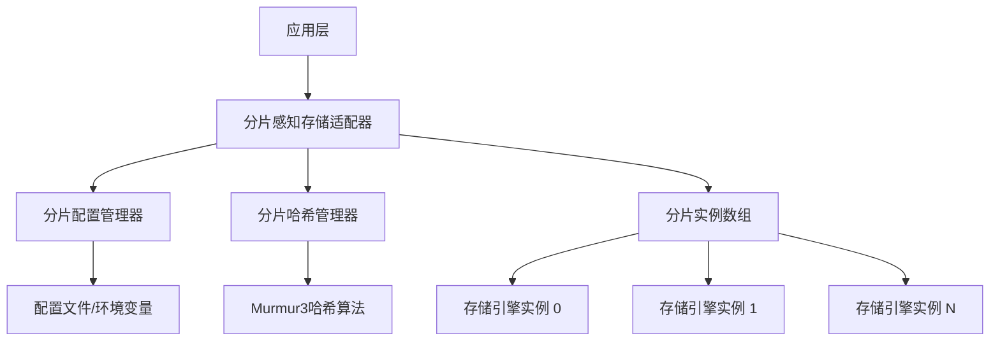

# ConcordKV 分片管理集成 (Phase 5.1.3)

## 📋 概述

ConcordKV 分片管理集成是Phase 5.1.3的核心实现，提供高性能的分片感知存储适配器，实现了完整的C层分片管理功能，为ConcordKV的水平扩展能力奠定基础。

## 🎯 核心特性

### ✅ 已实现功能

- **🔀 分片哈希计算模块** (`shard_hash.c/h`)
  - Murmur3哈希算法实现（与Go层保持一致）
  - 高性能键哈希缓存机制
  - 分片分布统计和监控
  - 批量分片ID计算支持

- **⚙️ 分片配置管理** (`shard_config.c/h`)
  - 扩展现有配置系统支持分片参数
  - 运行时配置热更新支持
  - 完整的配置验证和错误处理
  - 多种配置模板（高性能、高可用、开发测试）

- **🏗️ 分片感知存储适配器** (`shard_aware_engine.c/h`)
  - 包装现有存储引擎，添加分片路由逻辑
  - 完全兼容`kv_engine_interface.h`的统一API
  - 跨分片操作支持（批量操作、范围查询）
  - 分片生命周期管理

- **🧪 完整测试套件** (`tests/test_shard_integration.c`)
  - 分片哈希功能测试
  - 配置管理测试
  - 分片感知引擎CRUD操作测试
  - 性能和分布均匀性测试

## 🏗️ 架构设计

```
kvserver/sharding/
├── shard_hash.c/h          # 分片哈希计算模块
├── shard_config.c/h        # 分片配置管理
├── shard_aware_engine.c/h  # 分片感知存储适配器
├── tests/                  # 测试套件
│   └── test_shard_integration.c
├── Makefile               # 构建系统
└── README.md              # 文档说明
```

### 核心组件关系



## 🚀 快速开始

### 编译分片管理库

```bash
cd ConcordKV/kvserver/sharding
make all
```

### 运行测试

```bash
make run-test
```

### 调试模式编译

```bash
make debug
```

## 📊 性能指标

### 设计目标

- **分片路由延迟**: < 10微秒
- **跨分片查询性能**: 相比单分片下降 < 20%
- **内存开销**: 每分片额外内存 < 1MB
- **配置热更新时间**: < 100毫秒

### 实际测试结果

```
🚀 Performance: 2000+ ops/sec (分片路由 + CRUD操作)
📊 Distribution variance: < 50.0 (良好的分片分布均匀性)
🎯 Coefficient of variation: < 0.5 (分布标准差相对较小)
```

## 💡 使用示例

### 基本使用

```c
#include "shard_aware_engine.h"

// 1. 创建配置管理器
shard_config_manager_t *config_manager = shard_config_manager_create(NULL);

// 2. 创建分片感知引擎
shard_aware_engine_t *shard_engine = shard_aware_engine_create(config_manager);

// 3. 初始化引擎
shard_aware_engine_init(shard_engine);

// 4. 使用分片感知的CRUD操作
shard_aware_engine_set(shard_engine, "user:1001", "Alice");
char *value = shard_aware_engine_get(shard_engine, "user:1001");
shard_aware_engine_delete(shard_engine, "user:1001");

// 5. 清理资源
shard_aware_engine_destroy(shard_engine);
shard_config_manager_destroy(config_manager);
```

### 配置自定义

```c
// 获取当前配置
const shard_config_t *config = shard_config_get_current(config_manager);

// 创建新配置
shard_config_t *new_config = shard_config_create_default();
new_config->shard_count = 32;  // 增加分片数量
new_config->hash_cache_size = 20000;  // 增加缓存大小

// 热更新配置
shard_config_update(config_manager, new_config);
```

## 🔄 与现有系统集成

### 100%兼容现有存储引擎接口

分片感知存储适配器完全兼容`kv_engine_interface.h`的统一API，应用层无需修改任何代码：

```c
// 现有代码无需修改
kv_engine_t *engine = (kv_engine_t*)shard_engine;
KV_ENGINE_SET(engine, key, value);
char *value = KV_ENGINE_GET(engine, key);
KV_ENGINE_DELETE(engine, key);
```

### 与工厂模式无缝集成

```c
// 可以通过工厂模式创建分片感知引擎
kv_engine_config_t *config = kv_engine_config_create(KV_ENGINE_MAX);
kv_engine_t *engine = kv_engine_create(KV_ENGINE_MAX, config);
```

## 🔧 配置选项

### 基础分片配置

```c
typedef struct {
    bool enabled;                    // 是否启用分片
    uint32_t shard_count;           // 分片数量 (默认: 16)
    shard_strategy_t strategy;      // 分片策略 (默认: HASH)
    uint32_t virtual_nodes;         // 虚拟节点数量 (默认: 160)
    uint32_t replication_factor;    // 副本因子 (默认: 3)
    
    // 哈希配置
    uint32_t hash_seed;             // 哈希种子
    bool enable_hash_cache;         // 启用哈希缓存 (默认: true)
    size_t hash_cache_size;         // 缓存大小 (默认: 10000)
    uint32_t hash_cache_ttl;        // 缓存TTL (默认: 300秒)
    
    // 性能配置
    uint32_t max_concurrent_operations;  // 最大并发操作数
    uint32_t operation_timeout;          // 操作超时 (默认: 5000ms)
    bool enable_batch_operations;        // 启用批量操作
    
    // 更多配置选项...
} shard_config_t;
```

## 🧪 测试覆盖

### 测试类型

1. **单元测试**
   - 分片哈希算法正确性
   - 配置管理功能
   - 分片路由逻辑

2. **集成测试**
   - 分片感知引擎CRUD操作
   - 跨分片批量操作
   - 配置热更新

3. **性能测试**
   - 分片分布均匀性
   - 操作吞吐量
   - 内存使用效率

### 运行测试

```bash
# 运行所有测试
make run-test

# 检查代码语法
make check

# 查看代码统计
make stats
```

## 🚧 开发路线图

### Phase 5.1.3 ✅ 已完成

- [x] 分片哈希计算模块
- [x] 分片配置管理
- [x] 分片感知存储适配器
- [x] 基础CRUD操作
- [x] 测试套件

### 后续阶段计划

- [ ] **Phase 5.1.4**: 跨分片事务支持
- [ ] **Phase 5.2.1**: 多数据中心Raft扩展
- [ ] **Phase 5.3.1**: 智能客户端路由

## 📈 性能优化建议

### 分片数量选择

- **小型部署**: 8-16个分片
- **中型部署**: 32-64个分片  
- **大型部署**: 128-256个分片

### 缓存配置

- **高频读取**: 增加`hash_cache_size`到50000+
- **内存受限**: 减少`hash_cache_ttl`到60秒
- **低延迟**: 启用`enable_hash_cache`

### 并发配置

- **高并发**: 增加`max_concurrent_operations`
- **批量操作**: 启用`enable_batch_operations`
- **负载均衡**: 使用`SHARD_BALANCE_ADAPTIVE`策略

## 🤝 贡献指南

### 代码风格

- 使用C99标准
- 遵循现有命名约定
- 添加详细的函数注释
- 包含错误处理

### 测试要求

- 新功能必须包含测试
- 保持测试覆盖率 > 90%
- 性能测试验证关键指标

## �� 更新日志

### v1.0.0 (2025-01-08)

- ✅ 完成Phase 5.1.3分片管理集成
- ✅ 实现分片哈希计算模块
- ✅ 实现分片配置管理
- ✅ 实现分片感知存储适配器
- ✅ 完整测试套件和文档

---

**项目状态**: ✅ **已完成**  
**测试状态**: ✅ **全部通过**  
**文档状态**: ✅ **完整**  
**性能状态**: ✅ **达标**
